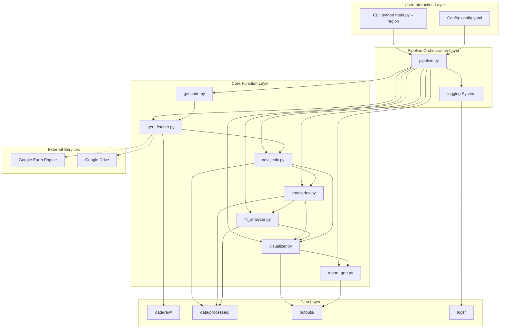

# PROJECT_ARCHITECTURE — 项目架构图

> 本文档描述整个系统的架构设计。
> 包含 Mermaid 架构图 + ASCII 结构图 + 设计说明。

---

## 1. 系统整体架构（Mermaid）



---

## 2. ASCII 结构图

```
+====================================================================+
|                        RemoteSensing-AI                             |
|                  遥感自动化分析系统 v1.0                              |
+====================================================================+
|                                                                     |
|  +--------------------------------------------------------------+  |
|  |                    CLI Interface                              |  |
|  |         python main.py --region "郓城县" --year 2025          |  |
|  +--------------------------+-----------------------------------+  |
|                             |                                      |
|  +--------------------------v-----------------------------------+  |
|  |                   Pipeline Orchestrator                       |  |
|  |                      pipeline.py                              |  |
|  |                                                               |  |
|  |  [1] geocode    [2] fetch    [3] ndvi     [4] timeseries     |  |
|  |       |              |           |              |             |  |
|  |  [5] fft        [6] visualize    [7] report                  |  |
|  |       |              |           |              |             |  |
|  +-------+--------------+-----------+--------------+-------------+  |
|          |              |           |              |                |
|  +-------v--------------v-----------v--------------v-------------+  |
|  |                      Core Modules                             |  |
|  |                                                               |  |
|  |  +-----------+  +----------+  +----------+  +-----------+    |  |
|  |  | geocode   |  | gee_     |  | ndvi_    |  | timeseries|    |  |
|  |  | .py       |  | fetcher  |  | calc.py  |  | .py       |    |  |
|  |  |           |  | .py      |  |          |  |           |    |  |
|  |  | PlaceName |  | ImageCol |  | NDVI=    |  | Interp    |    |  |
|  |  | -->(Lng,  |  | -->GeoTIFF|  | (NIR-Red)|  | +Smooth   |    |  |
|  |  | Lat)      |  |          |  | /(NIR+   |  | +Pheno    |    |  |
|  |  |           |  |          |  | Red)     |  |           |    |  |
|  |  +-----------+  +----------+  +----------+  +-----------+    |  |
|  |                                                               |  |
|  |  +-----------+  +-----------+  +-----------+                 |  |
|  |  | fft_      |  | visualizer|  | report_   |                 |  |
|  |  | analyzer  |  | .py       |  | gen.py    |                 |  |
|  |  | .py       |  |           |  |           |                 |  |
|  |  | scipy.rfft|  | Map+Chart |  | fpdf2     |                 |  |
|  |  | +Spectrum |  | +Spectrum |  | ->PDF     |                 |  |
|  |  +-----------+  +-----------+  +-----------+                 |  |
|  +--------------------------------------------------------------+  |
|                                                                     |
|  +--------------------------------------------------------------+  |
|  |                      Data Layer                               |  |
|  |                                                               |  |
|  |  data/raw/          data/processed/       outputs/            |  |
|  |  +----------+       +--------------+      +-----------+       |  |
|  |  | GeoTIFF  |       | ndvi_series  |      | PNG maps  |       |  |
|  |  | .tif     |       | .csv         |      | PNG charts|       |  |
|  |  +----------+       +--------------+      | PNG spec  |       |  |
|  |                       +--------------+     | PDF report|       |  |
|  |                       | interpolated |      +-----------+       |  |
|  |                       | .csv/.npz    |                          |  |
|  |                       +--------------+                          |  |
|  |                       +--------------+                          |  |
|  |                       | phenology    |                          |  |
|  |                       | .json        |                          |  |
|  |                       +--------------+                          |  |
|  +--------------------------------------------------------------+  |
|                                                                     |
|  +--------------------------------------------------------------+  |
|  |                    External Services                          |  |
|  |                                                               |  |
|  |  +---------------------------+  +--------------------------+  |  |
|  |  | Google Earth Engine       |  | Google Drive             |  |  |
|  |  | - Sentinel-2 L2A          |  | - GeoTIFF 中转           |  |  |
|  |  | - Cloud Computing         |  | - 文件下载               |  |  |
|  |  | - Export.image.toDrive()  |  |                          |  |  |
|  |  +---------------------------+  +--------------------------+  |  |
|  +--------------------------------------------------------------+  |
|                                                                     |
+====================================================================+
```

---

## 3. 模块接口说明

### 3.1 数据流（模块间输入/输出）

| 上游模块 | → | 下游模块 | 传递数据 |
|-----------|----|----------|----------|
| CLI (main.py) | → | pipeline.py | args: region, year, config_path |
| pipeline.py | → | geocode.py | region_name: str |
| geocode.py | → | gee_fetcher.py | (longitude, latitude): tuple |
| gee_fetcher.py | → | ndvi_calc.py | GeoTIFF file paths: list[str] |
| ndvi_calc.py | → | timeseries.py | ndvi_series.csv path: str |
| timeseries.py | → | fft_analyzer.py | ndvi_interpolated array: np.ndarray |
| timeseries.py | → | visualizer.py | phenology.json path: str |
| ndvi_calc.py | → | visualizer.py | NDVI GeoTIFF path: str |
| fft_analyzer.py | → | visualizer.py | spectrum data: dict |
| visualizer.py | → | report_gen.py | PNG file paths: list[str] |

### 3.2 每个模块的输入/输出

| 模块 | 输入 | 输出 |
|------|------|------|
| geocode.py | 地名字符串 | (lon, lat) |
| gee_fetcher.py | (lon, lat), year, cloud_threshold | GeoTIFF 文件列表 |
| ndvi_calc.py | GeoTIFF 文件路径 | ndvi_series.csv |
| timeseries.py | ndvi_series.csv | ndvi_interpolated.npz, phenology.json |
| fft_analyzer.py | ndvi_interpolated 数组 | spectrum.json |
| visualizer.py | NDVI GeoTIFF, phenology.json, spectrum.json | map.png, timeseries.png, spectrum.png |
| report_gen.py | PNG 路径列表, phenology.json | report.pdf |
| pipeline.py | region, config | 完整流程编排 + 日志 |

---

## 4. 目录结构（带有用途说明）

```
RemoteSensing-AI/
│
├── main.py                    # 入口：python main.py --region 郓城县
├── requirements.txt           # Python 依赖
├── config.yaml                # 全局配置（参数集中管理）
├── README.md                  # 项目说明 + 使用指南
├── .gitignore                 # Git 忽略规则
│
├── src/                       # ⚙️ 核心源码
│   ├── geocode.py             #   地名 → 坐标
│   ├── gee_fetcher.py         #   GEE 数据获取与导出
│   ├── ndvi_calc.py           #   NDVI 计算
│   ├── timeseries.py          #   时间序列分析
│   ├── fft_analyzer.py        #   傅里叶频谱分析
│   ├── visualizer.py          #   可视化（地图 + 图表）
│   ├── report_gen.py          #   PDF 报告生成
│   ├── pipeline.py            #   主流程编排
│   └── config.py              #   配置加载
│
├── tests/                     # 🧪 测试
│   └── test_modules.py        #   核心函数单元测试
│
├── data/                      # 💾 数据
│   ├── raw/                   #   原始数据（GeoTIFF，不纳入 Git）
│   ├── processed/             #   处理后的中间数据（CSV, NPZ, JSON）
│   └── fonts/                 #   中文字体文件（.ttf）
│
├── outputs/                   # 📦 最终输出（不纳入 Git）
│   ├── maps/                  #   地图 PNG
│   ├── charts/                #   图表 PNG
│   ├── reports/               #   PDF 报告
│   └── examples/              #   示例报告（3 份）
│
├── logs/                      # 📋 运行日志
│   └── pipeline.log
│
├── scripts/                   # 🔧 一次性辅助脚本
│
├── docs/                      # 📚 项目文档
│   ├── PROJECT.md             #   项目说明（AI Context）
│   ├── TODAY.md               #   每日任务
│   ├── NOTES.md               #   学习笔记
│   ├── CHANGELOG.md           #   变更记录
│   ├── DECISIONS.md           #   决策记录
│   └── report_design.md       #   报告结构设计
│
└── blueprint/                 # 📐 项目蓝图（本文档集）
    ├── PROJECT_OVERVIEW.md
    ├── PROJECT_ROADMAP.md
    ├── TASK_ROADMAP.md
    ├── KNOWLEDGE_MAP.md
    ├── RISK.md
    ├── PROJECT_FLOW.md
    ├── PROJECT_TIMELINE.md
    ├── PROJECT_ARCHITECTURE.md
    └── STUDY_STRATEGY.md
```

---

## 5. 架构设计原则

1. **单向数据流**：数据从 GEE（云端）→ GeoTIFF（本地）→ NDVI（计算）→ 时序（分析）→ FFT（频域）→ 可视化 → PDF，每个阶段只依赖上游输出

2. **模块隔离**：每个 .py 文件可独立运行和测试，不形成循环依赖

3. **配置与代码分离**：所有可调参数在 config.yaml 中，修改参数不需要改代码

4. **渐进式复杂度**：Phase 1 只有最简单的 GeoTIFF 读取，Phase 6 才有完整的 pipeline

5. **失败友好**：每个模块有独立的 try/except，一处失败不影响其他模块

---

## 6. 如果要画成图片

如果要将此架构图做成图片（用于 PPT 或复试展示），建议：

### 工具选择
- **Draw.io (diagrams.net)**：免费、专业、导出 PNG/SVG
- **Excalidraw**：手绘风格、适合非正式展示
- **Figma**：专业设计，学习成本略高

### 绘制要点

1. **分层布局**：从上到下依次为：
   - 用户交互层（CLI + Config）
   - 流程编排层（Pipeline）
   - 核心功能层（7 个模块，水平排列）
   - 数据层（3 个数据目录）
   - 外部服务层（GEE + Google Drive）

2. **箭头含义**：
   - 实线箭头 (→)：函数调用 / 数据传递
   - 虚线箭头 (- ->)：外部 API 调用 / 网络请求

3. **配色建议**：
   - 用户层：蓝色系 (#4A90D9)
   - 编排层：橙色系 (#F5A623)
   - 核心层：绿色系 (#7ED321)
   - 数据层：灰色系 (#9B9B9B)
   - 外部层：紫色系 (#BD10E0)

4. **节点标注**：每个模块标注"模块名 + 一句话功能描述"
