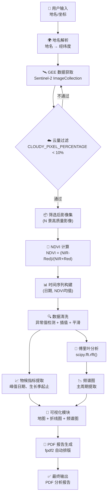
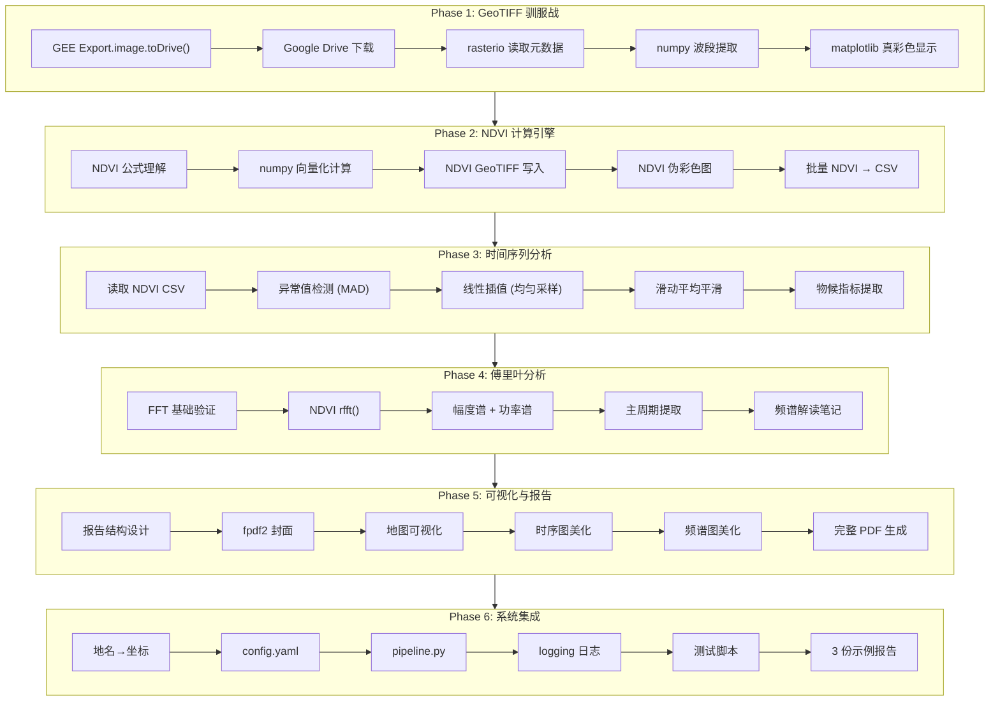
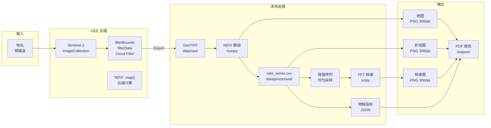
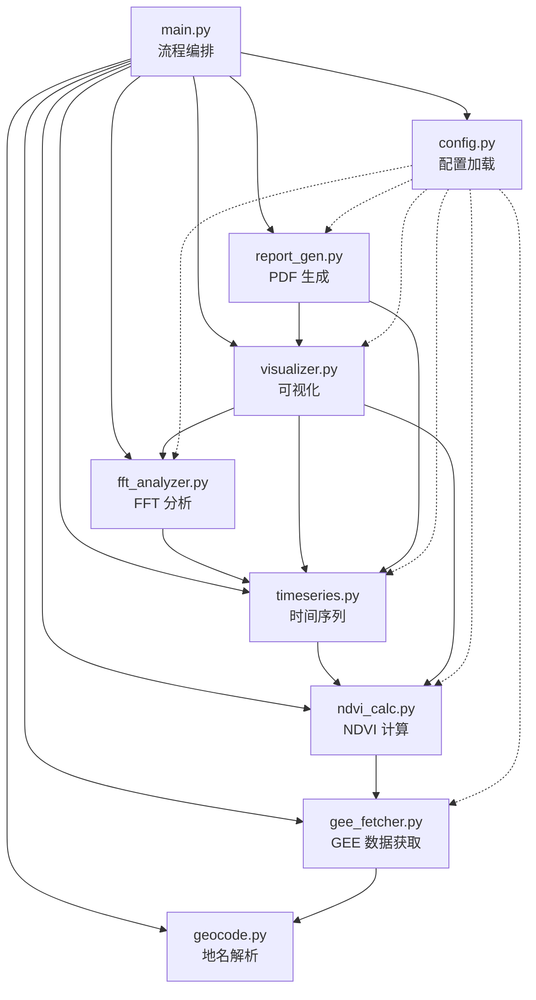
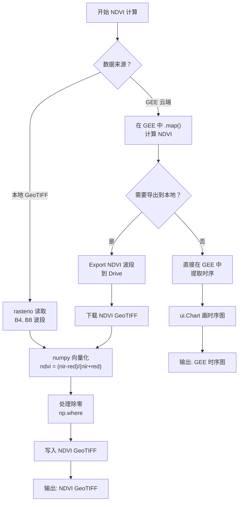
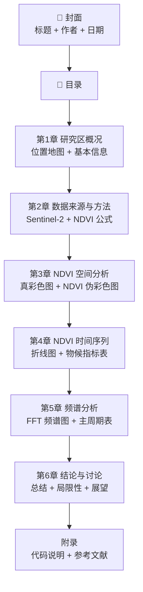
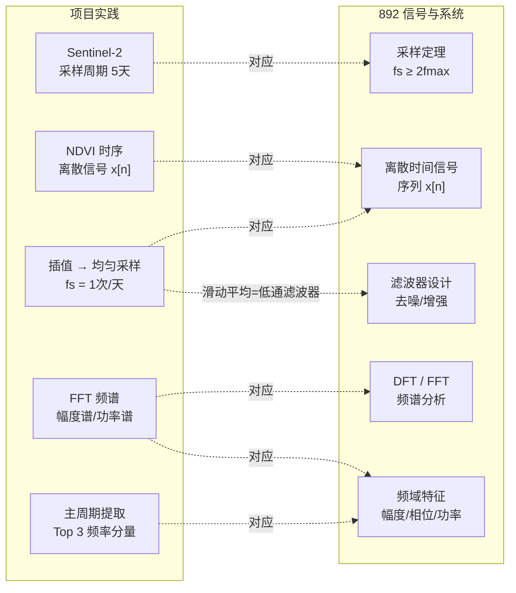

# PROJECT_FLOW — 项目流程图

> 使用 Mermaid 语法绘制，GitHub 和 VS Code 可直接渲染预览。

---

## 1. 系统总体流程（用户视角）

---

## 2. 技术实现流程（开发者视角）

---

## 3. 数据流转图

---

## 4. 模块依赖关系图

---

## 5. 每个 Task 的决策树（以 NDVI 计算为例）

---

## 6. 最终 PDF 报告结构

---

## 7. 考研知识关联流程

---

## 使用说明

1. **在 VS Code 中预览**：安装 Markdown Preview Mermaid Support 插件，按 `Ctrl+Shift+V` 预览
2. **在 GitHub 中预览**：直接 push，GitHub 会自动渲染 Mermaid 图表
3. **导出为图片**：使用 https://mermaid.live 复制粘贴代码，导出 PNG
